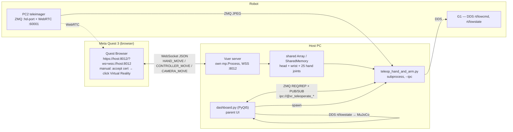
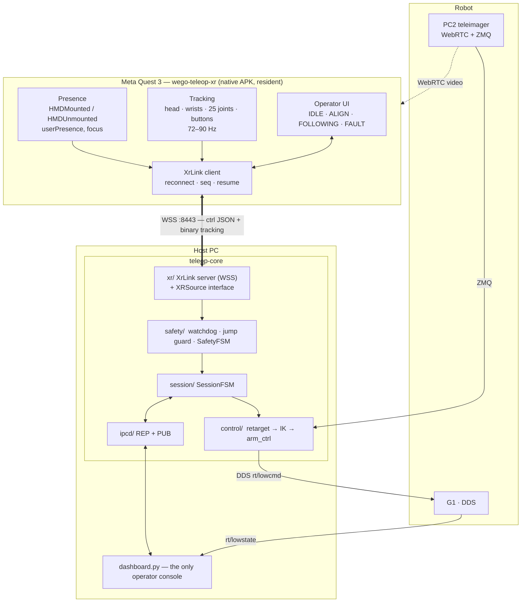
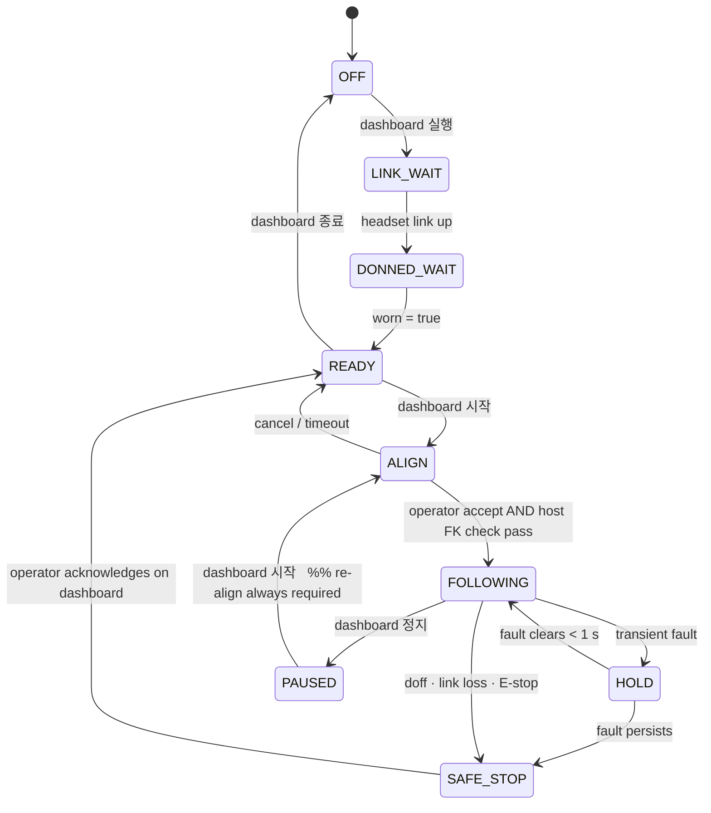

# VR Teleoperation — Automation & Safety Re-architecture Plan

Target hardware: **Meta Quest 3** + Unitree **G1 (29 DoF)** + Host PC (Ubuntu) + robot PC2 (teleimager).

Goals, in the order they matter:

1. **Safety** — doffing the headset must never move the robot. Today it can, and the mechanism is identified below.
2. **One console** — the PyQt dashboard on the Host PC is the only thing an operator touches. No browser, no URL, no cert warning, no "click Virtual Reality".
3. **Guided start** — Host UI presses 시작 → the headset prompts the operator to verify stance/arm pose → teleop begins only after the operator accepts *and* the host independently agrees.
4. **Clean architecture** — the XR device is one replaceable component behind a defined protocol.
5. **Reliable links** — real reconnect semantics on every channel, with a fail-safe (not fail-silent) default.

---

## 1. System as it exists today



Control path, concretely: `on_hand_move` writes raw 4×4 matrices into `multiprocessing.Array`s
([televuer.py:269](../teleop/televuer/src/televuer/televuer.py#L269)) → `TeleVuerWrapper.get_tele_data()` converts
OpenXR → robot convention ([tv_wrapper.py:242](../teleop/televuer/src/televuer/tv_wrapper.py#L242)) → `arm_ik.solve_ik` →
`arm_ctrl.ctrl_dual_arm(sol_q, sol_tauff)` ([teleop_hand_and_arm.py:364](../teleop/teleop_hand_and_arm.py#L364)) → a
250 Hz DDS writer thread.

---

## 2. The doff hazard — root cause

This is not speculation; it falls out of the transform chain.

Wrist targets are expressed **relative to the head**:

```python
# tv_wrapper.py:296-297  (hand tracking) and :397-398 (controller)
left_IPunitree_Brobot_head_arm[0:3, 3] = left_...world_arm[0:3, 3] - Brobot_world_head[0:3, 3]
```

So the commanded wrist position is `p_hand_world − p_head_world`. When the operator lifts the headset off and lowers it
to chest/waist height while their hands stay roughly put, `p_head_world.z` drops ~0.4–1.0 m and **the commanded wrist
target rises by the same amount**, instantly. The arms slam upward. No hand motion is required for this — a head-only
transient is sufficient.

Three amplifiers make it worse:

- **No staleness detection anywhere.** Nothing timestamps XR data. When `HAND_MOVE` stops arriving, the shared arrays
  keep their last values and `safe_mat_update` ([tv_wrapper.py:70](../teleop/televuer/src/televuer/tv_wrapper.py#L70))
  happily passes them through — it only rejects singular matrices, so a frozen *or* garbage-but-invertible pose is
  accepted as live data.
- **The rate limiter is not a safety limiter.** `arm_velocity_limit = 20.0` rad/s at `control_dt = 1/250`
  ([robot_arm.py:81-82](../teleop/robot_control/robot_arm.py#L81)) → 0.08 rad per cycle ≈ 1146 °/s. A full-scale target
  jump is executed in a fraction of a second. In `simulation_mode` the clip is bypassed entirely
  ([robot_arm.py:175-176](../teleop/robot_control/robot_arm.py#L175)).
- **No way to stop.** The only exits are `q` (full shutdown) and `p` (pause → `ctrl_dual_arm_go_home()`, which sets
  `q_target = zeros(14)` and drives there at full velocity limit — itself an aggressive move if the arms are extended).

There is also no gate at **start**: pressing 시작 goes straight from "waiting" to full IK following of whatever pose
the operator happens to be in ([teleop_hand_and_arm.py:261-269](../teleop/teleop_hand_and_arm.py#L261)). The README
handles this with a human instruction ("Align your arm to the robot's initial pose"). That is the same class of hazard
as the doff case, just at the other end of the session.

---

## 3. Defect inventory (transport & lifecycle)

Everything below is a distinct, reproducible defect. Fixing these is Phase 1 and is independent of the VR app work.

> **Status: all fixed.** See §9 for what shipped. The diagnoses are kept here because they explain *why* the code
> looks the way it does now, and each one has a regression test that fails against the original.

### 3.1 REP socket deadlock on malformed input
[ipc.py:107-122](../teleop/utils/ipc.py#L107) — if `recv_json()` raises (non-JSON payload), the loop logs and
continues. A ZMQ `REP` socket is a strict recv→send state machine: after a successful recv with no send, every
subsequent `recv` raises `EFSM` forever. One bad frame permanently deafens the command channel — including `CMD_STOP`.

### 3.2 Terminating the shared ZMQ context
[ipc.py:190](../teleop/utils/ipc.py#L190) and [ipc.py:314](../teleop/utils/ipc.py#L314) — both `stop()` methods call
`ctx.term()` on `zmq.Context.instance()`, the **process-wide singleton**. After teardown no component in that process
can create a socket again. This blocks any "stop teleop, start it again without relaunching" flow.

### 3.3 Two divergent IPC clients
`ipc.py` ships a correct `IPC_Client` with heartbeat liveness (`_hb_online`, 3-consecutive-beats-to-online, timeout to
offline) and `repid` correlation. `dashboard.py` ignores it and reimplements the client as `IPCBridge`
([dashboard.py:656-716](../teleop/dashboard.py#L656)) — **without** liveness tracking and **without** `repid`
verification. Consequences:
- `_hb_loop` treats the normal 500 ms `RCVTIMEO` expiry and a dead peer identically (`except: continue`), so the UI
  never learns the heartbeat stopped; phase/tag stay stale until the process-poll timer notices the exit.
- `send_cmd` fires into the void when teleop is gone, and a late reply from a previous request can be read as the
  answer to the current one.

### 3.4 Image subscriber dies permanently on first error
[image_client.py:349-352](../teleop/teleimager/src/teleimager/image_client.py#L349) — any recv/decode exception
`break`s the thread loop. The thread exits, but `ZMQ_SubscriberManager._subscriber_threads[key]` still holds the dead
object, so `get_head_frame()` returns `None`/stale from a corpse forever with no reconnect. The dashboard's
`CameraSource` has its own reconnect wrapper ([dashboard.py:741](../teleop/dashboard.py#L741)) but the teleop process
does not — so the headset video feed can die silently mid-session while teleop keeps running.

### 3.5 Manager state is class-level, not instance-level
[image_client.py:370-373](../teleop/teleimager/src/teleimager/image_client.py#L370) — `_subscriber_threads`,
`_running`, and `_lock` are class attributes. `close()` sets `_running = False` **on the class**, permanently. Any
second `ImageClient` created in the same process raises `RuntimeError("SubscriberManager is closed.")`.

### 3.6 Vuer session lifecycle
- The browser page has no auto-reconnect and no backoff — a WiFi blip means the operator takes the headset off and
  redoes the whole manual browser dance.
- Each session runs `while True: session.upsert(...)` ([televuer.py:346](../teleop/televuer/src/televuer/televuer.py#L346)).
  Nothing cancels the previous coroutine on reconnect, so repeat connects stack duplicate upsert loops against the same
  `bgChildren` keys.
- `TeleVuer.close()` ([televuer.py:210](../teleop/televuer/src/televuer/televuer.py#L210)) terminates the Vuer process
  before signalling the writer thread, and unlinks shared memory in a bare `except:`.
- `on_cam_move` / `on_controller_move` swallow everything with bare `except: pass`
  ([televuer.py:227](../teleop/televuer/src/televuer/televuer.py#L227), [:266](../teleop/televuer/src/televuer/televuer.py#L266)).
  A schema change or partial frame silently degrades to frozen pose data — which is exactly the input the safety layer
  must be able to detect.

### 3.7 Resume does not re-arm the velocity ramp
`speed_gradual_max()` is called once, before the main loop ([teleop_hand_and_arm.py:269](../teleop/teleop_hand_and_arm.py#L269)).
After a pause → resume, `arm_velocity_limit` is already at its 30 rad/s maximum, so the resume transient is taken at
full speed.

---

## 4. Target architecture



The load-bearing idea: **`XRSource` is an interface**, and the Quest app and the legacy Vuer browser are two
implementations of it. The control loop never learns which one is attached.

```python
@dataclass(frozen=True)
class XRFrame:
    seq: int
    t_device: float          # device monotonic clock
    t_host: float            # arrival stamp on host
    worn: bool
    focused: bool
    head: np.ndarray         # (4,4)
    left_wrist:  np.ndarray  # (4,4)
    right_wrist: np.ndarray  # (4,4)
    left_tracked: bool
    right_tracked: bool
    left_joints:  np.ndarray | None   # (25,3)
    right_joints: np.ndarray | None
    buttons: ControllerState | None

class XRSource(Protocol):
    def poll(self) -> XRFrame | None: ...          # newest frame, or None if none since last poll
    def link_state(self) -> LinkState: ...          # connected · rtt · seq gaps · last_rx
    def send(self, msg: HostToDevice) -> None: ...  # prompts, state mirror, abort
    def close(self) -> None: ...
```

`VuerXRSource` fills `worn`/`focused` from WebXR `visibilityState` and synthesises `seq` from an arrival counter.
`NativeXRSource` gets all of it from the device directly.

### 4.1 Session FSM (authoritative, lives on the host)



Two rules that carry most of the safety value:

- **`FOLLOWING` is only ever entered through `ALIGN`.** Resume after pause, recovery after a fault, reconnect after a
  network blip — all of them re-align. There is no path that silently resumes motion.
- **Fail-safe on absence of evidence.** The gate is "recent proof the operator is present and tracked", not "no proof
  they left". Silence is a fault.

### 4.2 Safety triggers

| Trigger | Detection | Action |
|---|---|---|
| Headset doffed | `worn=false` event, or presence beat gap > 300 ms | `SAFE_STOP` |
| Link down | no tracking frame > 200 ms | `HOLD`; > 1 s → `SAFE_STOP` |
| Hand tracking lost | per-hand `tracked=false` | `HOLD` (freeze target), session survives |
| **Head pose jump** | ‖Δp_head‖ > 0.15 m or Δθ > 30° in one cycle | reject frame + `HOLD`; 3 within 1 s → `SAFE_STOP` |
| Wrist target jump | ‖Δp_wrist‖ > 0.10 m per cycle | clamp to limit, log, count toward `HOLD` |
| Frozen data | identical head+wrist bits for > 300 ms while `worn` | `HOLD` (catches 3.6 silent-freeze) |
| IK divergence | ‖Δq‖ or residual over threshold | `HOLD` |
| Misaligned at start | host FK(current q) vs operator wrist pose out of tolerance | refuse `FOLLOWING` |
| E-stop | dashboard button, or both thumbsticks (motion mode) | `SAFE_STOP` + `Damp()` |

`SAFE_STOP` semantics — and this needs new primitives in `robot_arm.py`, because neither existing option is safe:

1. `arm_ctrl.hold()` — set `q_target = current measured q` (freeze in place, no motion).
2. Drop `arm_velocity_limit` to a slow value (≈3 rad/s).
3. `arm_ctrl.go_home_slow()` — ramp to home at the reduced limit.
4. Latch `FOLLOWING` off. Only a dashboard acknowledgement clears it.

Compare with today: `ctrl_dual_arm_go_home()` jumps `q_target` to zeros at 20–30 rad/s.

### 4.3 Link protocol (`XrLink`, WSS :8443)

One TLS port, two multiplexed channels. Certificate is **pinned in the native app** — this is what permanently kills
the "Advanced → Proceed (unsafe)" step.

**Control — JSON, ~10 Hz + events**

```jsonc
// device → host
{"t":"hello",    "proto":1, "dev":"quest3", "session":"<uuid>", "resume":"<uuid|null>"}
{"t":"presence", "worn":true, "focus":true, "ts":123.456}
{"t":"align_ack","accepted":true, "held_ms":2000, "ts":123.456}
{"t":"status",   "battery":0.72, "fps":72, "tracking":{"left":true,"right":true}}
{"t":"estop"}

// host → device
{"t":"state",   "session":"ALIGN", "reason":null}
{"t":"prompt_align", "target":{"left":[16],"right":[16]}, "tol":{"pos_m":0.08,"rot_deg":15}}
{"t":"abort",   "reason":"doffed"}
{"t":"video",   "mode":"passthrough|webrtc", "url":"https://192.168.123.164:60001/offer"}
```

**Tracking — binary, 72–90 Hz, device → host**

```
u16 magic | u8 proto | u8 flags{worn, left_tracked, right_tracked, mode}
u32 seq   | f64 t_device
f32[16] head | f32[16] left_wrist | f32[16] right_wrist
f32[75] left_joints | f32[75] right_joints        // hand mode
| controller block                                 // controller mode
```

Host stamps arrival, tracks seq gaps (loss %), estimates one-way delay from periodic ping/pong. The codec is
deliberately transport-agnostic so the tracking channel can move to UDP later without touching anything above it.

**Reconnect policy — one implementation, both channels.** Exponential backoff 100 ms → 2 s with jitter; session resume
by `session` id within 5 s preserves `READY`; anything longer forces re-align. **Any reconnect while `FOLLOWING`
triggers `SAFE_STOP` first** — the link coming back is never sufficient reason to resume motion.

### 4.4 What the operator actually does

| Step | Today | After |
|---|---|---|
| 1 | Launch dashboard | Launch dashboard |
| 2 | Put on headset | Put on headset — app is already resident, resumes on don |
| 3 | Open Quest Browser, type URL | — |
| 4 | Accept cert warning | — (pinned cert) |
| 5 | Click "Virtual Reality", allow prompts | — |
| 6 | Manually align to robot's initial pose | Headset shows the target pose + live deviation |
| 7 | Reach for the PC, press 시작 / `r` | Press 시작 on dashboard → headset prompts → hold both triggers 2 s |
| 8 | Take headset off → **arms move** | Take headset off → `SAFE_STOP`, arms hold then slow-home |

---

## 5. Phased delivery

### Phase 0 — Safety layer (host only, no VR app) · highest value, lowest risk
Works against the **existing** Vuer browser flow. Ships the accident fix on its own.

- Timestamp + sequence every XR datum in `televuer.py` (`Value('d')` per channel, written in the handlers).
- `safety/` package: `XRWatchdog` (staleness, freeze, seq gaps), `JumpGuard` (head + wrist deltas), `SafetyFSM`.
- Wire the gate immediately before `arm_ctrl.ctrl_dual_arm` in the main loop.
- `arm_ctrl.hold()` and `go_home_slow()`; re-arm `speed_gradual_max()` on every entry to `FOLLOWING`.
- Surface `worn` from WebXR `visibilityState` through the Vuer handler — approximate, but it catches the doff case.
- Dashboard: XR status panel (link · worn · staleness · safety state); 시작 disabled unless the link is live and worn.

*Exit criteria:* with teleop following, pulling the headset off stops the arms within 300 ms and requires an explicit
acknowledgement to re-arm. Verified in sim (`--domain 1`) before any robot test.

### Phase 1 — Transport hardening
Fixes §3.1–§3.5 and §3.7. Delete `IPCBridge`; the dashboard uses `IPC_Client`. Per-component ZMQ contexts, never
`instance()`. REP loop always replies or resets. Supervised, self-reconnecting image subscriber with instance-scoped
manager state. Heartbeat online/offline drives the UI directly.

### Phase 2 — `XRSource` abstraction + `XrLink` server
Extract the interface, adapt Vuer behind `VuerXRSource`, implement the WSS server and codec, implement the align gate
host-side (FK of current arm q → expected operator wrist pose → tolerance check). At this point the host is ready for a
native client and still runs on the browser one.

### Phase 3 — Quest 3 native app
Unity + OpenXR (Meta XR SDK) or bare OpenXR. Presence via `OVRManager.HMDMounted`/`HMDUnmounted` and
`CommonUsages.userPresence`. Passthrough by default. Align-check UI with hold-both-triggers-2 s confirm (deliberate
two-hand gesture — hard to trigger accidentally). State mirrored from host, so the headset always shows the same truth
as the dashboard. Video via WebRTC from PC2 (endpoint unchanged). Joint mapping OpenXR 26-joint → the 25-joint layout
`dex-retargeting` expects must be validated against recorded hand data before it drives hardware.

### Phase 4 — Decommission the browser path
Keep `VuerXRSource` behind a `--xr-source=vuer` flag as a fallback. Update README and `run_dashboard.sh`.

---

## 6. Constraints and risks — stated plainly

- **A browser-based client cannot meet requirement 2.** WebXR requires a user activation gesture to call
  `requestSession('immersive-vr')`. No amount of scripting removes the "click Virtual Reality" step. This is the reason
  Phase 3 exists; it is not a preference.
- ~~**"Auto-launch when worn" depends on device management.**~~ **Resolved: the Quests can be MDM-managed**, which is
  the good case — see §10. Kiosk / boot-to-app is available, so the operator never sees a launcher, and the fallback
  routes (resident foreground app, ADB boot receiver) are no longer needed.
- **`worn` from the browser is approximate.** WebXR `visibilityState` distinguishes `visible` / `visible-blurred` /
  `hidden`, and the transition on doff is not instant or uniformly timed. Phase 0's watchdog therefore leans on the
  staleness and head-jump detectors as the primary signals, with `visibilityState` as a fast hint. Phase 3 replaces
  this with the real proximity sensor.
- **Hand joint mapping is a correctness risk**, not a safety one, but it will silently produce wrong finger poses if
  the OpenXR→WebXR index mapping is off by one. Validate against recorded sessions before hardware.
- **Thresholds in §4.2 are starting values.** They need one tuning session in sim plus one supervised session on the
  robot with the arms clear.

---

## 7. Open questions (do not block Phases 0–2)

1. **Quest app toolchain** — Unity (fastest, Meta XR SDK is mature) vs. Godot 4 vs. bare OpenXR NDK? Is there existing
   Unity capability/licensing on the team?
2. ~~**Device enrolment**~~ — **answered: the Quest 3s can be MDM-managed.** See §10 for what that buys and what
   still needs deciding (which MDM platform).
3. **Primary input mode going forward** — hand tracking, controllers, or both? The align gate and the app's UI differ;
   both is more work but is doable if it is a real requirement.
4. **Video to the headset** — keep WebRTC from PC2 as-is (recommended: it already works and is off the critical control
   path), or fold it into `XrLink`?
5. **Multi-operator / observer** — does anything ever need a second headset or a spectator view, or is single-operator
   permanent? Affects whether `XrLink` is 1:1 or 1:N.

---

## 8. Phase 0 — as built

Shipped and unit-tested. Works against the **existing Vuer browser flow** — no VR app required.

### 8.1 What changed

| Area | File | Change |
|---|---|---|
| Safety layer (new) | `teleop/safety/` | `XRWatchdog` (staleness · freeze · seq · validity), `JumpGuard` (anomaly trips + Cartesian rate limit), `SafetyFSM` (latching state machine), shared types |
| XR liveness | `televuer.py` | Per-event sequence + monotonic stamps in shared memory; session attach/detach tracked around the spawn coroutine; handler errors logged (throttled) instead of swallowed |
| XR liveness | `tv_wrapper.py` | New `XRLinkStatus`, paired with each `get_tele_data()`; surfaces the `safe_mat_update` validity flags that were previously computed and discarded |
| Safe-stop | `robot_control/arm_safety.py` (new) | `ArmSafetyMixin`: `hold()`, `release_hold()`, `set_velocity_limit()`, `restore_velocity_limit()`, `safe_stop()`; mixed into all five controllers |
| Control loop | `teleop_hand_and_arm.py` | Gate before the EE arrays, locomotion and IK; arm/disarm on the START edge; `[e]` e-stop, `[a]` acknowledge; safety telemetry on the heartbeat |
| Console | `dashboard.py` | XR headset panel (link · worn · staleness · safety state · reason), 시작 gated with a reason tooltip, 비상 정지 and 안전정지 해제 buttons, telemetry decays when heartbeats stop |
| IPC | `utils/ipc.py` | `CMD_ESTOP`, `CMD_ACK_FAULT` |

### 8.2 Behaviour

- Pose events stop for **200 ms** → `HOLD`, arms frozen where they are.
- Pose events stop for **1 s**, or the Vuer session detaches → latched `SAFE_STOP`: freeze, drop the velocity ceiling
  to 3 rad/s, slow-home, and refuse to follow again until acknowledged.
- Head or wrist motion beyond human limits → `HOLD`; three trips in one second → latched stop.
- Every emitted wrist target is rate-limited to **2 m/s** in Cartesian space, so any transient that slips past the
  detectors is bounded rather than executed at the arm's 1146 °/s joint ceiling.
- `FOLLOWING` is only reachable through the START edge, which resets all baselines and re-arms `speed_gradual_max()`.
  Resume-after-pause no longer starts at full velocity.

### 8.3 Verify it

```bash
python -m unittest discover -s teleop/tests -v
```

43 tests, no DDS/Vuer/MuJoCo/PyQt needed. They cover doff-by-staleness, freeze, presence, link loss, tracking dropout,
the head-drop transient, clamping, gap recovery, latch/acknowledge, the hold latch, and the cross-module contracts
(`XRLinkStatus` ↔ `XRLiveness` field names, heartbeat keys, IPC command coverage).

Then, **in simulation before any robot test** (`--domain 1` / `--sim`):

1. Start following, then close the Quest browser tab → expect `HOLD` within ~200 ms, latched stop by ~1 s, and the
   dashboard panel to go red with a reason.
2. Press 안전정지 해제, then 시작 → following resumes with the velocity ramp restarted.
3. Start following, then pull the headset off normally → same outcome, driven by the proximity sensor blurring the
   WebXR session.
4. Kill the teleop process mid-session → the dashboard panel must decay to "미연결" within 1.5 s rather than freezing
   on the last good state.

### 8.4 Known limits of Phase 0

- **`worn` is always `None`** on the browser transport, so presence is inferred from data liveness rather than measured.
  The plumbing honours a real `worn` flag the moment a device supplies one (Phase 3). A slow doff is caught when events
  stop, not while the headset is in motion; the 2 m/s clamp is what bounds the arms during that window.
- **No start-alignment gate yet.** Pressing 시작 still begins following from whatever pose the operator is in. The
  velocity ramp softens it; the real fix is the Phase 2 align gate.
- **`--disable-xr-safety`** exists for bench bringup and turns all of the above off. It logs a banner at startup and a
  warning every 10 s while running. It should never be set on the robot.
- **Thresholds are starting values.** `--xr-stale-ms` and `--xr-dead-ms` are exposed on the CLI; the jump and clamp
  limits are in `teleop/safety/types.py`. They want one tuning pass in sim and one supervised pass on the robot with
  the arms clear.
- Phase 1 defects (§3) are **not** fixed yet — in particular the REP deadlock (§3.1) can still wedge the command
  channel, and the dashboard still uses its own `IPCBridge` rather than `IPC_Client`.

---

## 9. Phase 1 — as built

Transport hardening. Fixes §3.1–§3.6 (§3.7 was already handled in Phase 0).

### 9.1 What changed

| § | File | Fix |
|---|---|---|
| 3.1 | `utils/ipc.py` | `_data_loop` receives raw bytes and parses separately, so **every** received request produces exactly one reply. A failed send rebuilds the REP socket. |
| 3.2 | `utils/ipc.py` | Both `IPC_Server` and `IPC_Client` own a private `zmq.Context()`; `term()` can no longer tear down unrelated ZMQ users in the process. |
| 3.3 | `dashboard.py` | `IPCBridge` deleted. The dashboard now uses `IPC_Client`, gaining heartbeat liveness, `repid` correlation and `heartbeat_age()`. Heartbeats are polled on a 10 Hz timer instead of pushed from a worker thread. |
| — | `utils/ipc.py` | `REQ_RELAXED` + `REQ_CORRELATE` on the REQ socket: a timed-out reply no longer leaves it stuck in "must recv" with every later send raising `EFSM`. |
| 3.4 | `teleimager/.../image_client.py` | The subscriber thread supervises its own socket: recv/decode errors close and rebuild it with 0.5→5 s backoff instead of killing the thread. Only `stop()` ends it. |
| 3.5 | `teleimager/.../image_client.py` | Manager state moved from class attributes to instance attributes; `close()` retires the singleton so the next `get_instance()` returns a working one. `destroy(linger=0)` instead of `term()`, which could hang shutdown forever. |
| 3.6 | `televuer.py` | Reconnects cancel the superseded session coroutine, so `while True: session.upsert(...)` loops no longer stack. `close()` stops the writer thread *before* killing the Vuer process, kills it if terminate is ignored, and unlinks shared memory with specific handlers. |

### 9.2 New commands

`CMD_ESTOP` and `CMD_ACK_FAULT` are wired end to end: dashboard buttons → IPC → `on_press` → `SafetyFSM`.
`send_data(cmd, require_online=False)` lets a shutdown or e-stop through even when the heartbeat has already stopped.

### 9.3 Verify it

```bash
python -m unittest discover -s teleop/tests -v
```

70 tests. Phase 1 adds real-socket coverage over loopback TCP:

- **`test_ipc.py`** — malformed frames (non-JSON, non-object, empty, several in a row) each get an error reply and the
  server keeps serving; heartbeat online/offline transitions; a REQ timeout does not poison the channel.
- **`test_image_subscriber.py`** — frames flow; a killed publisher yields "no frame" rather than a stale one; the
  subscriber recovers when the publisher restarts; the thread survives a decode error; a second client works after
  `close()`.
- **`test_vuer_session.py`** — a reconnect cancels the previous session, five reconnects leave exactly one attached,
  a failing or cancelled session still detaches and never orphans its body.

The §3.1 deadlock was confirmed against the original code before fixing: one malformed frame, and every subsequent
valid request — including `CMD_STOP` — went unanswered for the life of the process.

### 9.4 Note for the robot host

The IPC addresses are now constructor parameters (`data_addr` / `hb_addr`) defaulting to the previous
`ipc://@xr_teleoperate_*.ipc` values — production behaviour is unchanged, but tests can bind loopback TCP, since
abstract-namespace `ipc://` sockets are Linux-only.

### 9.5 A note on ZMQ teardown

`close()` used to face a choice between two bad options when a subscriber thread outlives its join timeout:
`term()` blocks forever, and `destroy()` closes the socket out from under the running thread — libzmq responds to that
by aborting the whole process (`Socket operation on non-socket`, observed as a flaky crash during test teardown).
Neither is acceptable at shutdown, so the manager now checks whether the threads actually stopped: if they did, sockets
are already closed and `term()` returns immediately; if any is still alive, the context is deliberately **leaked** with
a warning. A leaked context at exit beats a hang or a crash.

---

## 10. Device management — resolved

The Quest 3s can be MDM-enrolled. This removes the largest open risk in Phase 3 and simplifies the app's job.

### 10.1 What it buys

| Capability | Why it matters here |
|---|---|
| **Kiosk / boot-to-app** | The app is the device's whole experience. Power on → app. Don → app. The operator never sees a launcher, never picks an app, never opens a browser. This is requirement 2, fully met. |
| **Private app distribution + remote update** | The APK ships to the fleet without the public store, and a fix reaches every headset without collecting them. Important for a safety-relevant client. |
| **Wi-Fi provisioning** | Headsets are pinned to the robot-lab SSID; no operator ever types a password or lands on the wrong network. |
| **CA / certificate push** | The host's self-signed cert can be trusted at OS level. Belt-and-braces: the app should still pin it (§4.3), which works with or without MDM. |
| **Sleep / display timeout policy** | Long timeouts keep the app and its link alive across short doffs — see §10.2, this is worth more than it first appears (and §10.3 for its limits). |
| **Fleet health** | Battery, connectivity and app version per device, visible before a shift rather than discovered mid-task. |

Platform choice is now the only sub-question: Meta's own managed offering vs. a third-party Quest MDM (ArborXR and
ManageXR are the common ones). The capability set above is broadly equivalent across them; the differences that matter
for us are how private APKs are pushed and how kiosk mode is configured. **Confirm which platform is in use before
Phase 3 starts** — the app itself is unaffected, but the deployment runbook is not. Feature names in Meta's console
change frequently, so verify against the current one rather than this table.

### 10.2 The part that is easy to get backwards

It is tempting to configure the headset to sleep aggressively when doffed, on the theory that a sleeping headset cannot
move the robot. That is the wrong instinct, and it is worth being explicit about why.

Today, **link-up and operator-present are the same signal** — the only evidence Phase 0 has that someone is wearing the
headset is that pose events are still arriving. That conflation is exactly why the doff hazard needed a watchdog and a
clamp to paper over it, and why a slow doff is only caught once events stop.

A native app **separates the two**:

- `session_up` — the app is running and the link is healthy.
- `worn` — the proximity sensor says a head is in the headset. A terminal fault the instant it goes false (§4.2).

Once they are independent, keeping the app alive through a doff is an advantage:

- The stop becomes **fast** — one control cycle (~33 ms) from a measured signal, instead of waiting out the 200 ms
  staleness deadline.
- The link, session state and video stay up, so re-donning goes straight to the align prompt instead of a reconnect,
  a certificate dance and a cold start.
- The dashboard can distinguish "headset asleep / operator stepped away" from "headset crashed or fell off the
  network", which are very different things for the person at the console.

So: set generous sleep and display timeouts via MDM, and let presence — not power state — be the safety signal.

### 10.3 …but the doff message must never be load-bearing

On doff the Quest OS may suspend the app or throttle its loops, depending on power management and background settings.
That lands on the worst possible moment: the instant we most want a message delivered is the instant the OS is least
willing to let the app run.

**So `worn=false` is an optimisation, not the safety mechanism.** The design rule:

> The system must be correct if the doff message never arrives. It is merely *faster* when it does.

That is already how the implemented layer behaves — the watchdog is primary and fires on absence of evidence, with
`worn` as a fast path (§4.2). The claim being corrected here is the earlier "no 200 ms staleness window, no reliance on
the clamp": both stay, permanently, as the backstop. Concretely, if the app is suspended before it can transmit:

| | with the presence message | if it never arrives |
|---|---|---|
| arms frozen (`HOLD`) | ~33 ms | ≤ 200 ms (`stale_s`) |
| latched (`SAFE_STOP`) | immediate | ≤ 1 s (`dead_s`) |

The number that matters for hazard is the first row: the arms are frozen either way, and the difference is ~170 ms.

Four requirements follow, for the Phase 3 app:

1. **Send presence first, from the event handler.** `OVRManager.HMDUnmounted` → transmit immediately, fire-and-forget,
   ahead of any other work in that frame. Do not batch it behind the tracking stream.
2. **Carry `worn` redundantly in the tracking frame header.** The binary format already reserves a flags bit for it
   (§4.3), so the last frames before suspension carry the bit even if the control message is lost.
3. **Allow background execution** (`Application.runInBackground`, plus whatever the manifest/Meta-side equivalent turns
   out to be) so the handler gets the few milliseconds it needs. Verify empirically — this is exactly the kind of
   platform behaviour that should be measured on the actual device and OS build rather than assumed from docs.
4. **Treat resume as untrusted.** If the OS did suspend the app, `HMDMounted` / `OnApplicationPause(false)` resumes it
   with a stale session, and tracking may come back in a relocalised frame — the head pose can jump. The app must
   re-announce presence and force re-validation; the host already refuses to re-enter `FOLLOWING` except through
   `ALIGN`, and `JumpGuard.rebaseline()` already handles the discontinuity.

**Bringup acceptance test** (measure, do not assume): instrument the host to log the interval between the last frame
carrying `worn=true` and the safety layer latching. Doff the headset 20 times, in both a warm session and after the
device has been idle. Record p50/p95, and confirm the *fallback* path also works by killing the app process mid-session
and checking the same latch happens within `dead_s`. If p95 of the fast path is not comfortably under `stale_s`, the
presence message is not buying anything and the design should lean entirely on the watchdog.

### 10.4 Presence API reference

Meta XR SDK (Unity/C#) — polling plus events, both worth having; the event gives the fast path, the poll catches a
missed edge:

```csharp
void OnEnable() {
    OVRManager.HMDMounted   += HandleHMDMounted;
    OVRManager.HMDUnmounted += HandleHMDUnmounted;   // send worn=false HERE, first
}
void OnDisable() {
    OVRManager.HMDMounted   -= HandleHMDMounted;
    OVRManager.HMDUnmounted -= HandleHMDUnmounted;
}
void Update() {
    bool isWorn = OVRManager.isUserPresent;          // also goes in the tracking frame flags
}
```

Vendor-neutral alternative, if the toolchain question lands on bare OpenXR: `CommonUsages.userPresence` on
`XRNode.Head` via Unity's XR Input subsystem. Behaviour reportedly varies between the native Meta loader and a stock
OpenXR runtime, so whichever is chosen needs the §10.3 measurement run against *that* configuration — this is a point
where the two toolchain options are not interchangeable.

### 10.5 Still open

1. **Toolchain** — Unity + Meta XR SDK vs. Godot 4 vs. bare OpenXR NDK.
2. **Input mode** — hand tracking, controllers, or both.

Neither blocks Phase 2.

---

## 11. Phase 2 — as built

The device becomes replaceable, and the last unguarded hazard closes.

### 11.1 The XR seam

```
teleop/xr/
  types.py         XRFrame  -- device-neutral payload + liveness
  source.py        XRSource -- the interface
  vuer_source.py   VuerXRSource   (Quest browser + Vuer, ships today)
  codec.py         XrLink wire format  <- what the Quest app is built against
  link_server.py   XrLinkServer   (asyncio websockets, own thread)
  native_source.py NativeXRSource (XRSource over XrLink)
```

The control loop reads `frame = xr.read()` and never learns which device is attached. Swapping transports is one
branch (`--xr-source=vuer|xrlink`).

`XRFrame` deliberately carries **only the seventeen values the control loop actually consumes**, not televuer's ~40.
Narrowing it documents the real dependency surface and is what makes a second implementation tractable — the Quest app
has to produce these and nothing else. A static contract test parses the loop's AST and asserts every `frame.<attr>` it
reads exists on `XRFrame`, so a missed field fails at test time rather than mid-teleop.

### 11.2 The alignment gate

The gate requires **two independent agreements, held continuously**:

1. **The host agrees** — `ArmFKMixin.forward_kinematics(q)` gives where the robot's wrists actually are, through the
   same pinocchio `L_ee`/`R_ee` frames `solve_ik` drives to. Computing it any other way risks comparing two subtly
   different frames, which is the exact bug class the gate exists to catch. Because it is derived from robot state, a
   headset that lies or mis-transforms cannot talk its way past it.
2. **The operator agrees** — both pinches (hand mode) or both triggers (controller mode), held for `--align-hold`
   seconds. Two-handed on purpose: this is the last thing between the operator and a moving robot, and a one-handed
   gesture is far too easy to trigger while getting into position.

Either lapsing resets the hold to zero. Ten seconds of intermittent agreement never adds up to acceptance — there is a
test for exactly that. FK failure reports "cannot verify", never "verified", and logs once so it cannot masquerade as a
hang.

**This works on the transport that ships today.** The confirm gesture comes from existing Vuer pinch/trigger data, so
the gate is live without waiting for the native app. On the browser transport the prompt renders on the dashboard
(deviation per wrist, hold progress, cancel) because that transport is receive-only; `NativeXRSource.send()` will put
it in the headset.

### 11.3 Wire format

`teleop/xr/codec.py`, protocol version 1. Header 16 B, controller frame 240 B, hand frame 840 B, little-endian.
`worn` rides in the frame header redundantly with the control-channel presence message, for the §10.3 reason. Decode
refuses — never partially accepts — bad magic, a future protocol version, wrong length, or a hand-mode flag on a
controller-sized frame (which would alias the input block as joint data).

### 11.4 One decision to revisit before the app team starts

**The wire currently carries robot-convention poses with wrists already in the IK target frame** — the device does the
OpenXR→robot transform. That keeps the host free of a per-runtime transform table, but it puts safety-relevant geometry
on the device side, and every new device reimplements it with a fresh chance to get a sign wrong.

The alternative — raw OpenXR on the wire, one transform on the host — keeps that math in a single reviewed place. It
was not done here because it means extracting the transform chain out of `tv_wrapper.get_tele_data()` and duplicating
it, with no way to validate against real device data from this side.

**Recommendation: switch to raw-OpenXR-on-the-wire when the app work starts**, while the protocol still has no
implementations to migrate. Bumping `PROTO_VERSION` is cheap now and expensive later.

### 11.5 Verify it

```bash
python -m unittest discover -s teleop/tests -v
```

134 tests. Phase 2 adds: 24 codec (round-trip, sizes, byte order, every rejection path), 22 link-server against a real
in-process WebSocket client (connect/supersede/disconnect, tracking, presence, e-stop, malformed frames not disturbing
good state), 20 align-gate, plus the XRFrame coverage contract.

### 11.6 New flags

| Flag | Default | Meaning |
|---|---|---|
| `--xr-source` | `vuer` | `vuer` (browser) or `xrlink` (native app) |
| `--xrlink-port` | `8443` | XrLink listen port |
| `--align-pos-tol` | `0.10` | Per-wrist position tolerance (m) |
| `--align-rot-tol` | `25.0` | Per-wrist orientation tolerance (deg) |
| `--align-hold` | `2.0` | Seconds of continuous agreement required |
| `--skip-align` | off | **Dangerous.** Bypass the gate; logs a banner |

`CMD_CANCEL_ALIGN` (`[c]`) abandons an alignment in progress.

### 11.7 Still not done

- **TLS on XrLink.** The server takes an `ssl_context`; nothing constructs one yet. Needs the cert story settled
  alongside MDM CA push (§10.1).
- **XrLink is untested against a real device** — only against an in-process client. Expect protocol friction at first
  contact.
- Thresholds remain starting values (§8.4).

---

## 12. Phase 3 — shortest effective track

Three decisions, taken to minimise total time-to-working while *reducing* risk rather than trading it away.

### 12.1 Decision: Unity + Meta XR SDK

Not because Unity is nicer, but because of the presence API. `OVRManager.isUserPresent` plus the
`HMDMounted`/`HMDUnmounted` delegates are well-defined; OpenXR's `CommonUsages.userPresence` behaves differently
between the native Meta loader and a stock runtime, which would force the §10.3 measurement to be redone per
configuration. Presence is the safety signal — it gets the best-defined API available.

Secondary: passthrough, controllers and hand tracking are turnkey, and `System.Net.WebSockets.ClientWebSocket` ships
with Unity's .NET Standard profile and works under IL2CPP on Android — so the transport needs **no third-party
dependency**.

### 12.2 Decision: controllers first, hand tracking as v1.1

The OpenXR 26-joint → 25-joint mapping that `dex-retargeting` expects is the single largest correctness risk in
Phase 3, and it is *independent* of the transport. Shipping both at once means debugging a brand-new link and a
suspect joint mapping simultaneously, with fingers on a real robot.

Controllers already support everything the current `--input-mode controller` path does: arm control, dex1 gripper via
trigger, locomotion via thumbsticks, and a two-handed trigger confirm for the align gate. Hand tracking then lands on
a transport that has already been proven.

### 12.3 Decision: protocol v2 carries raw OpenXR — done, not deferred

§11.4 flagged this as worth revisiting. It has been done, because it turned out not to be a trade-off at all: moving
the transform to the host makes the **app smaller** as well as the geometry safer. The device now performs exactly one
convention change — the Unity→OpenXR handedness flip, four lines — instead of reimplementing the basis change, arm
initial-pose rotations, head-relative subtraction and waist offsets in C#.

`teleop/xr/transforms.py` holds the chain, with 23 tests asserting *physical* claims rather than a transcription:
up→+z, right→−y, forward→+x, det=+1 (a reflection would silently mirror left and right), rotation angle preserved
through the basis change, and — directly — that lowering the head 0.5 m raises the wrist target by exactly 0.5 m.

### 12.4 What was built

| Path | What |
|---|---|
| `teleop/xr/transforms.py` | OpenXR→robot chain, shared by every device |
| `tools/fake_quest.py` | Headset simulator — ten scenarios over real XrLink |
| `quest_app/Assets/Scripts/XrLinkClient.cs` | Transport + framing, mirrors `codec.py` byte for byte |
| `quest_app/Assets/Scripts/TeleopSession.cs` | Presence, tracking capture, host state |

### 12.5 The simulator is the point

`tools/fake_quest.py` impersonates the headset over the real link. The entire host stack can be exercised with **no
headset and no robot**, and it is the reference the C# client is checked against: if a scenario behaves differently
in the simulator and on device, the device is wrong.

```bash
python teleop/teleop_hand_and_arm.py --ipc --xr-source xrlink --sim
python tools/fake_quest.py --list
python tools/fake_quest.py --scenario doff
```

Scenarios map one-to-one onto the §4.2 failure modes: `steady`, `doff`, `silent-doff` (OS suspended before it could
transmit), `disconnect`, `dropout`, `freeze`, `jump`, `untracked`, `estop`, `confirm`.

Driving the real `XrLinkServer` → `NativeXRSource` → `SafetyFSM` pipeline with it:

| scenario | outcome |
|---|---|
| `steady` | 154/154 cycles followed, **zero faults** — no false positives in normal use |
| `doff` | latched, `operator_absent(headset not worn)` |
| `silent-doff` | latched, `link_down(no data for 1.00s)` — the fallback path, working |
| `freeze` | latched, `frozen(1312ms)` |
| `jump` | 87/88 followed; one cycle held on `head_jump`, then recovered |
| `untracked` | latched, `tracking_lost(left+right)` |
| `disconnect` | latched, `link_down(no XR session)` |

The `steady` row matters as much as the others: a safety layer that stops the robot during normal operation is not a
safety layer, it is an outage.

### 12.6 Three things that will bite

1. **Handedness.** Unity is left-handed (+z forward), OpenXR right-handed (+z backward). `ToOpenXR()` is the entire
   conversion. If the arms mirror left/right on the robot, look there first — nothing else in the chain can produce
   that symptom.
2. **Presence ordering.** `HMDUnmounted` must transmit before anything else in that frame. `Application.runInBackground`
   is set, but per §10.3 that alone is not always sufficient — measure it.
3. **No client-side safety logic.** The app reports; the host decides. Two half-implementations of a safety rule are
   worse than one. This is called out in the C# header comments because it is exactly the kind of "helpful" addition a
   later contributor makes in good faith.

### 12.7 Runbook

**Unity project**
- Unity 6 LTS (or 2022.3 LTS), Android build target, IL2CPP + ARM64, .NET Standard 2.1.
- Meta XR Core SDK. OpenXR backend, Quest 3 device target.
- Player Settings → **Run In Background** on.
- Passthrough enabled; the align check happens in passthrough so the operator can see the real robot.
- Attach `TeleopSession` to one scene object; set `HostAddress` to the Host PC and `UseTls` to match the server.

**TLS.** `XrLinkServer` accepts an `ssl_context`; nothing constructs one yet. Either push the host CA to the fleet via
MDM (§10.1) or pin the certificate in the app. Until then run `--xr-source xrlink` with `UseTls = false` on an isolated
lab network only.

**MDM.** Enrol, upload the private APK, enable kiosk / boot-to-app, provision the lab Wi-Fi, and set **generous** sleep
and display timeouts (§10.2 — presence, not power state, is the safety signal).

**Acceptance before the robot.** Run the §10.3 doff-latency measurement: p50/p95 over 20 doffs, warm and cold, plus a
process-kill to confirm the fallback still latches within `dead_s`. If the fast path's p95 is not comfortably under
`stale_s`, the presence message is not earning its place and the design should lean entirely on the watchdog.

### 12.8 Still open

- Hand tracking (v1.1) and its 26→25 joint mapping — validate against recorded sessions before it drives hardware.
- TLS, as above.
- XrLink has still never met a real device. Expect protocol friction at first contact; the simulator is what makes that
  cheap to resolve.

---

## 13. The APK — as built

Phase 3 left two C# files and a runbook. This section covers turning that into an installable artefact, and the four
defects that surfaced in the process. `quest_app/` is now a real Unity project that builds from a clean clone with one
command.

### 13.1 What was added

| Path | What |
|---|---|
| `quest_app/Packages/manifest.json` | Meta XR Core SDK 78.0.0 via Meta's npm registry, Oculus XR Plugin 4.5.1 |
| `quest_app/Assets/Editor/QuestBuild.cs` | Every build setting, as code. Generates the scene, assigns the XR loader, builds |
| `quest_app/Assets/Editor/QuestManifest.cs` | Patches the generated Android manifest — permission, cleartext, focus-aware, VR category |
| `quest_app/Assets/Scripts/TeleopBootstrap.cs` | Builds the camera rig, passthrough, session and HUD at runtime |
| `quest_app/Assets/Scripts/TeleopHud.cs` | In-headset status panel |
| `tools/build_quest_apk.ps1` | Locates the toolchain, runs batchmode, sideloads |

The `.unity` scene is deliberately **not** committed. A Unity scene file is generated YAML full of GUIDs pointing into
a package that gets upgraded: unreviewable in a diff, and it breaks in ways that only reproduce on the machine that
opened it. The scene graph here is fifteen objects, so `TeleopBootstrap` builds it at runtime and `QuestBuild`
generates the one-object scene that holds it. The practical benefit is that the Editor build script needs no knowledge
of the Meta SDK at all — every OVR reference in the project sits in two runtime files.

`ProjectSettings/` **is** committed, but `QuestBuild` re-applies every setting that matters on each build anyway. A
wrong scripting backend or a missing ARM64 flag is invisible in a diff and does not surface until the APK fails on a
device, so the committed files are the starting point and the code is the guarantee.

### 13.2 Building it

```powershell
.\tools\build_quest_apk.ps1 -HostAddress 192.168.123.2 -Install
```

Prerequisite, and how to get it:

```powershell
& 'C:\Program Files\Unity Hub\Unity Hub.exe' -- --headless install-modules --version 2022.3.32f1 -m android --childModules
```

That pulls Android Build Support, the SDK, the NDK and OpenJDK — everything, including `adb`. Unity 2022.3.32f1 with
Meta XR Core SDK 78.0.0 is the pinned pairing; 78.0.0 declares `unity: 2022.3` / `unityRelease: 15f1`, so the installed
editor sits inside its support window.

First build ~9 minutes (package resolution plus a cold IL2CPP compile), later builds a couple of minutes. Output is a
**23.8 MB** APK: ARM64 only, IL2CPP, minSdk 32 / targetSdk 34.

The host address is **baked in at build time** — a new Host PC means a new build. That is deliberate: a runtime address
picker is one more thing to get wrong while wearing a headset, and MDM pushes a per-site APK anyway.

### 13.3 Four defects found on the way

Worth recording, because three of them were latent in code that had already been reviewed and tested.

**1. Buttons were wired to nothing.** `codec.py` defined a `buttons` control message, `native_source.py` read
`frame.buttons`, and `TrackingFrame.buttons` was a tuple that was always empty — the server had no branch to populate
it, and the app never sent one. On the native path `right_a` (quit) and both thumbstick clicks (**damp — the soft
emergency stop**) silently did nothing. The always-empty field is what made it invisible: it read like the source of
truth. Buttons now live on `LinkSnapshot`, that field is gone, and `BUTTON_NAMES` is the shared vocabulary.

**2. The app did not compile.** `SendTrackingAsync(in TrackingSample)` — C# forbids `in` parameters on async methods
(CS1988). Two further hazards sat in the same method: `Pack()` wrote into a reused buffer *before* taking the send
lock, so overlapping sends could rewrite bytes mid-transmit; and every tracking frame was queued rather than dropped,
which turns a slow link into unbounded latency the host cannot distinguish from an operator moving slowly. Packing now
happens inside the lock, and a frame that finds a send already in flight is **skipped and counted**
(`SkippedFrames`, shown on the HUD) rather than queued.

**3. `OVRManager.isUserPresent` is an instance property, not static** — and the instance is null until the rig wakes.
Presence now reads `ovr != null && ovr.isUserPresent`, so absence of evidence is reported as absence. Fail-closed.

**4. The simulator was streaming at ~10,000 Hz, not 72 Hz.** `time.monotonic()` has 15.6 ms granularity on Windows
before Python 3.13, and asyncio fires any timer due within one clock resolution — so `await asyncio.sleep(1/72)`
returns immediately once the event loop has other work, which it does the moment a websocket is attached. Every timing
observation made with `fake_quest` on a Windows box was therefore made against a flood. `_stream` now paces on an
absolute `perf_counter` schedule and prints its measured rate; verified at 72 Hz.

### 13.4 What the app does

| State | Shown when |
|---|---|
| `DISCONNECTED` | no link to the host; reconnecting with backoff |
| `WAITING` | headset just donned; set by the app until the host says otherwise |
| `IDLE` | host is linked and healthy but not following |
| `ALIGN` | host is running the alignment gate — progress bar live |
| `FOLLOWING` | host is driving the arms from this headset |
| `HOLD` | transient fault; arms frozen |
| `SAFE_STOP` | latched fault; needs an acknowledgement on the host |
| `DOFFED` | headset came off |

The host now pushes `{"t":"state"}` for the **whole** session rather than only during alignment — on change, then every
0.5 s as a keepalive, and every 0.1 s while aligning, where the operator is adjusting their stance against a progress
bar. Before this the headset could only ever display `ALIGN`. An operator in passthrough can see the robot but not
*why* it stopped: the terminal log is on the host and they are wearing a headset.

**Emergency stop: Y + B**, the secondary face button on each controller. Symmetric, reachable without looking, and not
bound to anything else — A/X quits and the thumbstick clicks damp. It *requests* a stop; the host decides, exactly like
every other signal from the device.

### 13.5 Bring-up order

In order. Each step is cheap to debug because the one before it is known good.

1. **Host with the simulator — no headset, no robot.**

```bash
python teleop/teleop_hand_and_arm.py --ipc --xr-source xrlink --sim
python tools/fake_quest.py --scenario steady      # follows, zero faults
python tools/fake_quest.py --scenario doff        # operator_absent, latched
python tools/fake_quest.py --scenario buttons     # damp, then quit
```

`steady` matters as much as the fault cases: a safety layer that stops the robot during normal operation is an outage,
not a safety layer.

2. **Headset against the host, robot still off.** Sideload, launch, confirm `WAITING` on the HUD and a device
connection in the host log. Then doff it and watch the host latch. This is first contact between the C# client and the
Python host — expect protocol friction here and nowhere else, because everything upstream is already proven.

3. **Doff-latency measurement (§10.3).** p50/p95 over 20 doffs, warm and cold, plus a process kill to confirm the
watchdog fallback still latches within `dead_s`. **Be willing to conclude the presence message does not earn its
place**: if its p95 is not comfortably under `stale_s`, the design should lean entirely on the watchdog and the fast
path should be deleted rather than trusted.

4. **Robot, arms clear, hand on the host keyboard.** Only now.

### 13.6 Verified, and not

Verified here: the APK builds from a clean clone; ARM64 + IL2CPP + `libOVRPlugin.so` + `libopenxr_loader.so` are in it;
the manifest carries INTERNET, cleartext, `com.oculus.vr.focusaware`, the VR launcher category and
`com.oculus.supportedDevices`; the manifest also declares `com.oculus.feature.PASSTHROUGH`; the button path drives the real `XrLinkServer` →
`NativeXRSource` end to end at 72 Hz; 168 host tests pass, five of which check the C# source against the Python for
protocol version, magic number, frame sizes, button vocabulary, and that the HUD names every `SafetyState` the host
can send rather than letting a new one render as "nothing in particular".

**Not verified: any of it on a headset.** No Quest has run this APK. The handedness flip, the presence timing, the
passthrough setup and the HUD placement are all unexercised.

> **Superseded 2026-08-18 — see §14.** A Quest 3 has now run this APK. The link, codec, reconnect and frame rate all
> work; the device-side capture does not. Four defects, including a head pose stuck at the origin and a dead
> device-side e-stop. Read §14 before trusting anything in this section. §12.6 lists handedness first for a reason — if the arms
mirror left and right, `ToOpenXR()` is the only thing that can cause it. If passthrough comes up black, the manifest
feature is declared `required="false"` (Meta's "Supported" rather than "Required") — that is the first thing to try
changing, in `QuestManifest.cs`.

Still open beyond that: TLS (`UseTls = false` is the default because there is no server-side context to talk to —
isolated lab network only, and this remains the one thing that looks finished and is not), hand tracking and its 26→25
joint mapping, and threshold tuning against real human motion rather than synthetic.

---

## 14. First contact with a real Quest 3 — 2026-08-18

The APK finally met the host. §13.6's "not verified on a headset" is now partly answered: the transport works, and the
device-side capture does not. Everything below is measured, not inferred — the raw numbers are in §14.3.

Setup: Isaac Sim (`Isaac-PickPlace-Cylinder-G129-Dex3-Joint`, `--enable_dex3_dds`, DDS domain 1) on the host at
192.168.123.2, Quest 3 at 192.168.123.3 over the demo router, `ws://192.168.123.2:8443` with TLS off.

### 14.1 What worked

- **Protocol v2 negotiated on the first attempt.** `hello from quest3 proto=2`, no framing or version friction. The
  §12.8 warning to "expect protocol friction at first contact" did not materialise — the codec's C#/Python parity
  tests earned their place.
- **Reconnect backoff works on the wire**, not just in the simulator: repeated drops recovered without intervention.
- **72 Hz sustained** — the device's own telemetry reported 2000 frames in 27.75 s, and the host counted 978 unique
  sequence numbers in 30 s.
- **The watchdog's `frozen` detector fired correctly on real data.** It was not a false positive: the head pose
  genuinely was frozen, for the reason in §14.2. This is the first time a safety detector caught a real device fault
  rather than a synthetic one.

### 14.2 Four device-side defects

All four are in `quest_app/`. None are host-side, and none were reachable by the 168 host tests.

**1. The head pose is always exactly the identity matrix.** This is the serious one. `TeleopSession.Head()` resolves
to the `OVRCameraRig` centre-eye anchor, and that anchor is never updated on a rig built at runtime through
`AddComponent` — so `head.position` stays at the origin for the life of the session.

The consequence is not "the head is missing", it is worse than that. The whole transform chain is
`p_wrist − p_head` (§2). With `p_head ≡ 0` the wrists are sent in absolute tracking-space coordinates, and the
head-relative frame the robot expects silently becomes something else. `JumpGuard`'s head-jump detector can also never
fire, because a constant is never a jump — the detector for the project's founding hazard is dead on this transport.

The controllers prove the fix direction: `PoseOf()` uses `OVRInput.GetLocalControllerPosition()`, which reads node
poses directly and works perfectly. The head should use the same path — `OVRPlugin.GetNodePose(Node.EyeCenter, …)` or
`InputTracking.GetLocalPosition(XRNode.CenterEye)` — rather than depending on a rig anchor being driven.

**2. `OVRInput.IsControllerConnected()` returns false for both controllers, permanently**, while those same
controllers stream live poses. The host therefore latches `tracking_lost(left+right)` and refuses to follow, so the
session can never leave `idle`. The device is not at fault: `dumpsys input` shows both Touch controllers registered,
enabled and classed `INPUT_DEVICE_CLASS_VR_PERIPHERAL`, and the system logged
`InputDevice_TrackedRemote: typical controller latency in com.wegorobotics.g1teleop: 0.024` for each of them.
`OVRInput.GetControllerPositionTracked()` reports actual tracking validity and is the right query here.

**3. No button message ever reaches the host.** `buttons` stayed `()` across every frame of every session, including
while Y+B was pressed. **The device-side emergency stop does not work.** §13.3 recorded fixing the button path
end-to-end, but that fix was verified against `fake_quest`, which synthesises the control message directly — it never
exercised `OVRInput.Get(Button…)` on hardware. Same root as defect 2: node poses work, controller *state* queries do
not.

**4. `Debug.Log` output is stripped from the release build.** Zero `[XrLink]` / `[Teleop]` lines in logcat across the
whole session, while `[OVRManager]` lines from the SDK appear normally. Every diagnosis above had to be made from the
host side instead. For bring-up this needs to be fixed first, or the next defect costs as much to find as these did.

### 14.3 The measurement that settled it

`XrLinkServer` run standalone as a probe, no teleop and no safety layer, logging the decoded frame. 978 unique frames
over 30 s while the operator moved head and both controllers deliberately:

```
head  : spread(xyz)=[0.     0.     0.    ]  FROZEN
left  : spread(xyz)=[0.2071 0.1647 0.1174]  LIVE
right : spread(xyz)=[0.1835 0.1586 0.1138]  LIVE

flag combos seen (left_tracked, right_tracked, worn): {(False, False, True)}
button sets seen: {()}
```

Two channels of the same device, sampled identically: the controllers move 20 cm and the head does not move at all.
That single table separates "the operator is standing still" from "the head is not wired up", and no amount of reading
the C# would have done it as quickly. **Probe the wire before reading the source** — the device is the only authority
on what the device sends.

Three earlier diagnoses were wrong before this measurement: that the controllers were switched off (they were not),
that the app had lost focus (it had, repeatedly, but `tracking_lost` persisted through a 26 s focused window), and that
`OVRInput` was dead altogether (its pose half works fine). Each was consistent with the evidence available at the time
and each was refuted by the next measurement.

### 14.4 Also found, host-side

**The `vtv` environment shadows this repo with three other checkouts.** `televuer` and `teleimager` resolve to
`~/unitree_sim_isaaclab/xr_teleoperate/`, `dex_retargeting` to `~/xr_teleoperate/`, all via editable-install `.pth`
files. The Vuer path therefore crashes on startup against a `televuer` that predates the Phase 0 liveness work:

```
AttributeError: 'TeleVuerWrapper' object has no attribute 'get_link_status'
```

The 168 tests do not catch this — they import the repo's own copies directly, while at runtime the `.pth` wins. Until
the installs are repointed, both paths need:

```bash
export PYTHONPATH="teleop/televuer/src:teleop/teleimager/src:teleop/robot_control/dex-retargeting/src"
```

This also means the Phase 1 `image_client` fixes (§3.4, §3.5) have never run — the other checkout's copy was loaded
every time.

**`teleop_hand_and_arm.py` must be run from `teleop/`.** The URDF path is relative (`../assets/g1/…`), so the
invocation in §12.5 and §13.5 fails from the repo root. `dashboard.py` already spawns it with `cwd=teleop/`.

**`run_dashboard.sh` takes `sim` as a positional argument, not `--sim`.** `--sim` reaches `dashboard.py`, which has no
such flag, and argparse rejects it. Easy to trip over, because the teleop script it launches *does* use `--sim`.

### 14.5 The align gate is not covered by the simulator

`fake_quest` emits fixed synthetic poses (head at 1.60 m, wrists at ±0.20/1.50/−0.30), which sit ~50 cm from wherever
the robot's FK puts its wrists. The gate correctly refuses — `move to the robot's pose — off by left 50cm, right 50cm`
— which means **no simulator scenario can ever reach `FOLLOWING` through the gate.** §12.5's "154/154 cycles followed"
was measured with `--skip-align`, and that is not recorded there.

So the gate has unit tests but no end-to-end coverage. Making `fake_quest` read the robot's FK and offer a pose near
it would close that hole, and is worth doing before the gate is trusted on hardware.

### 14.6 What this leaves

Verified today, on hardware: the link, the codec, reconnect, frame rate, and the watchdog's freeze detector.

Still unverified, and now blocked behind §14.2: handedness (§12.6 — the wrists arrive, but nothing has consumed them
through IK yet), presence timing (§10.3's doff-latency run), passthrough, HUD placement, the align gate on a real
operator, and TLS.
